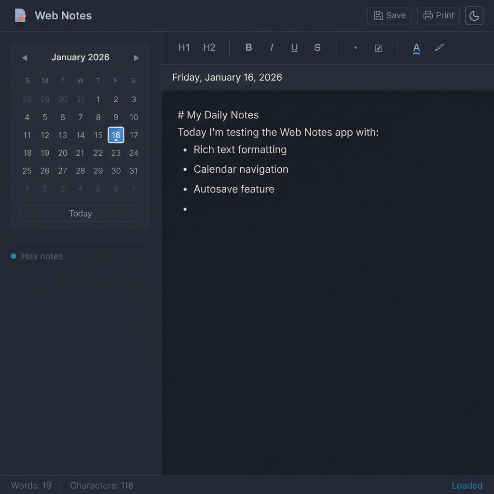
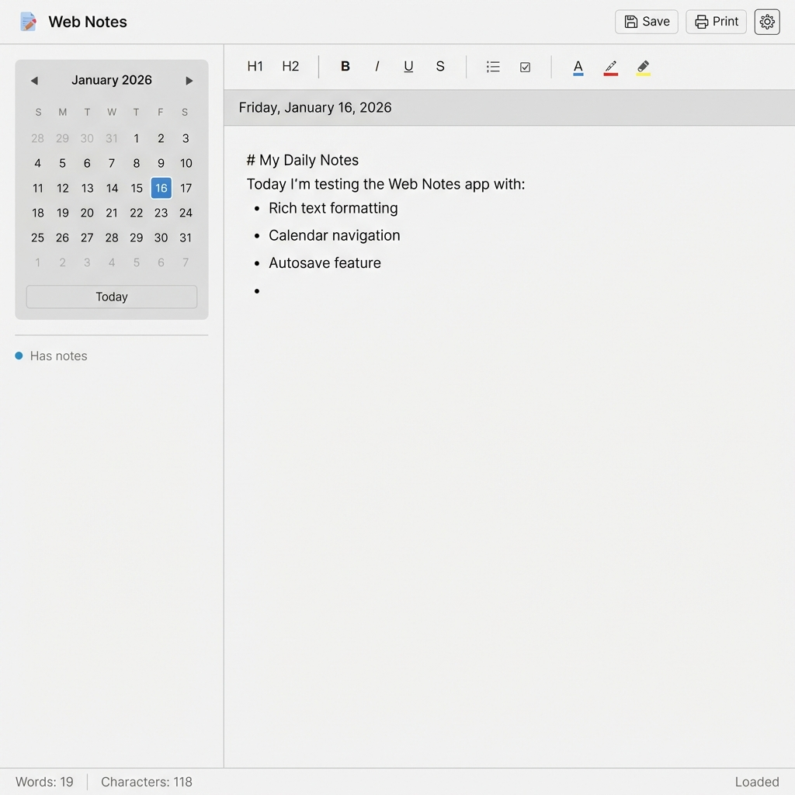

# 📝 Web Notes

A beautiful, functional notes-taking web application with **calendar-based navigation** and **rich text formatting**, designed with a **Forex Factory-inspired utility-first aesthetic**.

<p align="center">
  
</p>

## ✨ Features

### 📅 Calendar Navigation
Navigate your notes by date with an intuitive monthly calendar:
- **Visual indicators** - Dots show which dates have notes
- **Click any date** to view/edit that day's notes
- **Today button** for quick access to current date
- **Month navigation** with previous/next controls

### ✏️ Rich Text Formatting
A full-featured formatting toolbar:

| Tool | Function | Shortcut |
|------|----------|----------|
| **H1** | Large heading | - |
| **H2** | Section heading | - |
| **B** | Bold text | `Ctrl+B` |
| **I** | Italic text | `Ctrl+I` |
| **U** | Underline text | `Ctrl+U` |
| **S** | ~~Strikethrough~~ | - |
| **•** | Bullet list | - |
| **☑** | Checkbox (toggleable) | - |
| **🎨** | Text color picker | - |
| **🖍** | Highlight color | - |

### 💾 Automatic Saving
- **Autosave every second** - Never lose your work
- **localStorage persistence** - Data survives browser restart
- **Per-date storage** - Each day has its own notes
- **No server required** - Works completely offline

### 🎨 Themes
Toggle between carefully designed themes:

<table>
<tr>
<td align="center"><strong>Dark Theme</strong><br>(Default)</td>
<td align="center"><strong>Light Theme</strong></td>
</tr>
<tr>
<td></td>
<td></td>
</tr>
</table>

### 📄 Export Options
- **Save as .txt** - Download your notes
- **Print** - Direct browser printing support

---

## 🚀 Quick Start

### Option 1: Direct File Access
Simply open `index.html` in your browser - no server required!

### Option 2: Local Server
```bash
# Clone the repository
git clone https://github.com/devgothwal/web-notes.git
cd web-notes

# Start a simple server
python3 -m http.server 8080

# Open in browser
# http://localhost:8080
```

### Option 3: Live Server (VS Code)
Use the Live Server extension for hot reload during development.

---

## 📁 Project Structure

```
web-notes/
├── index.html              # Main application (single-page app)
├── styles/
│   └── main.css            # Complete styling (CSS variables, themes)
├── scripts/
│   ├── app.js              # Main controller (theme, save, print)
│   ├── calendar.js         # Calendar component
│   └── editor.js           # Rich text editor with autosave
├── screenshots/            # Documentation images
│   ├── dark-theme.png
│   └── light-theme.png
├── docs/
│   └── ARCHITECTURE.md     # Technical documentation
└── README.md
```

---

## 🛠️ Technical Details

### Technologies
- **Pure HTML5, CSS3, JavaScript** - No frameworks or build tools
- **CSS Variables** - Easy theming and customization
- **localStorage API** - Persistent data storage
- **contenteditable** - Native rich text editing
- **execCommand API** - Text formatting commands

### Browser Support
| Browser | Support |
|---------|---------|
| Chrome | ✅ Full |
| Firefox | ✅ Full |
| Safari | ✅ Full |
| Edge | ✅ Full |
| Opera | ✅ Full |

### Data Storage
Notes are stored in localStorage with date-based keys:
```javascript
// Storage format
localStorage.setItem('webnotes_2026-01-16', '<html content>');
localStorage.setItem('webnotes_theme', 'dark');
```

---

## ⌨️ Keyboard Shortcuts

| Shortcut | Action |
|----------|--------|
| `Ctrl + B` | Bold |
| `Ctrl + I` | Italic |
| `Ctrl + U` | Underline |
| `Ctrl + S` | Force save |
| `Tab` | Indent text |

---

## 🎨 Customization

### Changing Colors
Edit the CSS variables in `styles/main.css`:

```css
:root {
    --bg-primary: #1e222d;      /* Main background */
    --accent-primary: #4a90d9;  /* Accent color */
    --text-primary: #e0e0e0;    /* Main text color */
}
```

### Adding Fonts
Import your preferred fonts in `index.html`:
```html
<link href="https://fonts.googleapis.com/css2?family=YourFont&display=swap" rel="stylesheet">
```

---

## 🤝 Contributing

1. Fork the repository
2. Create your feature branch (`git checkout -b feature/AmazingFeature`)
3. Commit your changes (`git commit -m 'Add AmazingFeature'`)
4. Push to the branch (`git push origin feature/AmazingFeature`)
5. Open a Pull Request

---

## 📜 License

MIT License - feel free to use and modify for any purpose!

---

## 🙏 Acknowledgments

- **Design Inspiration**: [Forex Factory](https://www.forexfactory.com) - Utility-first, clean interface
- **Feature Reference**: [Online Notepad](https://onlinenotepad.org) - Simple, functional note-taking

---

<p align="center">
  Made with ❤️ for productivity
</p>
